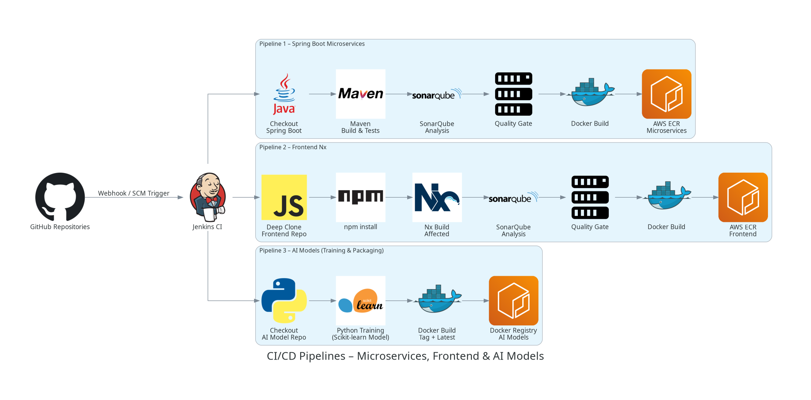

# Estate Rental - Cloud-Native Kubernetes Infrastructure

Ce dépôt contient l'infrastructure as code (IaC) pour le déploiement de la plateforme **Estate Rental**, orchestrée par Kubernetes. L'architecture repose sur une approche **GitOps** et modulaire grâce à **Kustomize**, garantissant une séparation stricte entre la logique applicative et les spécificités d'environnement (Local vs Cloud AWS).

## � Global Architecture & Pipeline

Cette section illustre le flux complet de l'application **Estate Rental**, intégrant l'ensemble des composants du système :
- **Frontend** : Interface utilisateur interactive.
- **Microservices** : Logique métier distribuée (Auth, User, Property, etc.).
- **AI Models** : Intégration des modèles d'intelligence artificielle pour les fonctionnalités avancées.



---

## �🏗 Architecture Kustomize (The Source of Truth)

Nous utilisons **Kustomize** pour gérer la complexité des manifestes Kubernetes sans duplication de code. L'architecture est divisée en deux couches :

### 1. `base/` : Le Cœur Immuable
Ce dossier contient la définition "pure" des microservices, indépendante de l'environnement de déploiement.
- **Deployments** : Chaque microservice est configuré avec des **Resource Limits** strictes (ex: `768Mi` RAM) pour garantir la stabilité des nœuds et éviter le OOMKill.
- **Services** : Exposés uniquement en `ClusterIP` pour la communication interne sécurisée.
- **Observabilité** : Les annotations Prometheus (`prometheus.io/scrape: "true"`) sont intégrées nativement pour permettre le scraping des métriques JVM.

### 2. `overlays/` : L'Adaptation Contextuelle
Ce dossier applique des patches (modifications) sur la base pour s'adapter à la cible de déploiement.

#### 🛠 `overlays/minikube/` (Environnement de Développement)
Conçu pour une itération rapide en local.
- **Exposition** : Patch les services Gateway et Frontend en `type: NodePort` pour un accès direct depuis la machine hôte.
- **Infrastructure Locale** : Déploie les dépendances stateful (MySQL, Kafka, Zookeeper) sous forme de conteneurs dans le cluster.
- **Configuration Dynamique** : Un patch ConfigMap injecte l'IP dynamique du Frontend pour gérer les problèmes de CORS et de redirection en local.

#### ☁️ `overlays/eks/` (Production AWS)
Configuration "Cloud-Ready" pour Amazon EKS.
- **Ingress Controller** : Utilise **AWS Load Balancer Controller** (ALB) pour gérer le trafic entrant de manière scalable et sécurisée.
- **Services Managés** : Remplace les conteneurs de base de données par des endpoints pointant vers **Amazon RDS** et **Amazon MSK** via des patches d'environnement.

---

## 🔭 Observabilité & Monitoring

La stack de monitoring est isolée dans le dossier `monitoring/` et repose sur le standard **Prometheus Operator**.

### ServiceMonitor & Auto-Découverte
Le fichier `microservices-monitoring.yaml` définit un **ServiceMonitor** qui cible automatiquement les 6 microservices majeurs du projet.
- **Mécanisme** : Il scanne tous les Services portant le label `app` correspondant et le port nommé `http`.
- **Port `http`** : Il est CRITIQUE que chaque Service dans `base/` nomme son port `http` (et non juste 8080) pour que le ServiceMonitor puisse identifier la cible de scraping.

### Dashboards Grafana
Les métriques exposées par **Micrometer** sont visualisables dans Grafana.
- **Dashboard Recommandé** : JVM (Micrometer) - **ID 4701**.
- **Indicateurs Clés** : Utilisation Heap/Non-Heap, GC Pauses, Threads, et Uptime.

---

## 🔐 Configuration & Sécurité (Zero-Hardcoding)

L'infrastructure respecte le principe de **Zero-Hardcoding** pour faciliter la maintenance et la sécurité.

- **ConfigMaps** : Centralisent les configurations non-sensibles (URLs des services, profils Spring, options JVM).
    - *Note* : Dans l'overlay Minikube, l'URL du Frontend est patchée dynamiquement pour correspondre à l'IP du cluster local.
- **Secrets** : Les identifiants de base de données et mots de passe sont extraits dans des objets `Secret` Kubernetes.
    - *Sécurité* : En production, ces secrets doivent être synchronisés depuis un vault externe (ex: AWS Secrets Manager) via ExternalSecrets Operator.

---

## 🚀 Guide d'Exécution

### Prérequis
- Cluster Kubernetes (Minikube ou EKS)
- `kubectl` configuré

### Déploiement

#### 1. Environnement Local (Minikube)
Déploie l'application avec l'infrastructure locale et les accès NodePort.
```bash
kubectl apply -k k8s/overlays/minikube
```

#### 2. Environnement Cloud (AWS EKS)
Déploie l'application connectée aux services managés AWS.
```bash
kubectl apply -k k8s/overlays/eks
```

#### 3. Monitoring
Active la collecte des métriques (nécessite Prometheus Operator installé).
```bash
kubectl apply -k k8s/monitoring
```

### ✅ Vérification

Pour valider que le monitoring fonctionne correctement :
1. Accédez à l'interface Prometheus (via port-forward).
2. Allez dans **Status > Targets**.
3. Vérifiez que les endpoints des microservices (gateway, auth, user, etc.) sont en état **UP**.

---
*Document généré par l'équipe SRE - Estate Rental Project*
